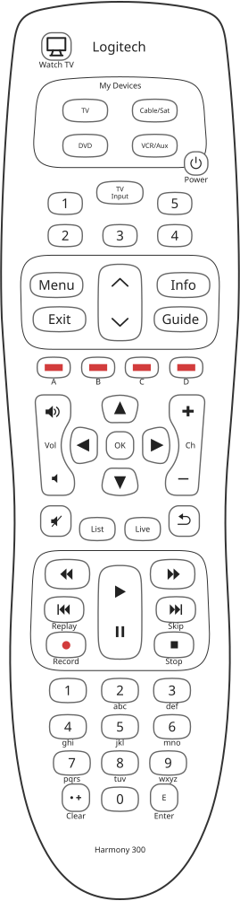

# Harmony 300: keys

The drawing, [`reference/silhouettes/h300.svg`](../../silhouettes/h300.svg), is generated from
`packages/silhouettes/src/models/h300.ts`, which **takes every shape from the Harmony 350's drawing** and
states only what is printed differently: the two are one moulding, a statement from the bench holding
both. The printing is read off the cover photograph of Logitech's setup guide, PDF page 2.

## How the printing differs from the 350's

| | Harmony 300 | Harmony 350 |
|---|---|---|
| device keys | TV, Cable/Sat, DVD, VCR/Aux | TV / AVR, Cable/DVD, BD / Media, Game/MP3 |
| power key | `Power` printed under it | |
| the key between the favourites | TV over Input, and no "Favorites" word | Input, under "Favorites" |
| colour keys | yellow, blue, red, green, with A to D under them | red, green, yellow, blue |
| the key the 350 prints DVR | List | DVR |
| the four keys beside play | Replay, Skip, Record and Stop printed under them | |
| the top and bottom of the face | Logitech's logo, and "Harmony 300" | "Harmony" |

All from `h300.ts`, read off Logitech's setup guide.

## Every key on the drawing

<!-- generated:keys -->
55 keys on the drawing `h300`, 55 on the keypad and 0 that the screen speaks for. 0 carry a measured scan code and 0 are left between two candidates by the drawing.

| key | kind | name from | scan code | screen zone | printed on or beside it |
|---|---|---|---|---|---|
| `Blue` | keypad | printed | not measured |  | B |
| `CableSat` | keypad | printed | not measured |  | Cable/Sat |
| `ChannelDown` | keypad | printed | not measured |  |  |
| `ChannelUp` | keypad | printed | not measured |  |  |
| `Clear` | keypad | printed | not measured |  | Clear |
| `DirectionDown` | keypad | printed | not measured |  |  |
| `DirectionLeft` | keypad | printed | not measured |  |  |
| `DirectionRight` | keypad | printed | not measured |  |  |
| `DirectionUp` | keypad | printed | not measured |  |  |
| `DownArrow` | keypad | printed | not measured |  |  |
| `Dvd` | keypad | printed | not measured |  | DVD |
| `Enter` | keypad | printed | not measured |  | E, Enter |
| `Exit` | keypad | printed | not measured |  | Exit |
| `FastForward` | keypad | printed | not measured |  |  |
| `Favorite1` | keypad | printed | not measured |  | 1 |
| `Favorite2` | keypad | printed | not measured |  | 2 |
| `Favorite3` | keypad | printed | not measured |  | 3 |
| `Favorite4` | keypad | printed | not measured |  | 4 |
| `Favorite5` | keypad | printed | not measured |  | 5 |
| `Green` | keypad | printed | not measured |  | D |
| `Guide` | keypad | printed | not measured |  | Guide |
| `Info` | keypad | printed | not measured |  | Info |
| `Input` | keypad | printed | not measured |  | TV, Input |
| `List` | keypad | printed | not measured |  | List |
| `Live` | keypad | printed | not measured |  | Live |
| `Menu` | keypad | printed | not measured |  | Menu |
| `Number0` | keypad | printed | not measured |  | 0 |
| `Number1` | keypad | printed | not measured |  | 1 |
| `Number2` | keypad | printed | not measured |  | 2, abc |
| `Number3` | keypad | printed | not measured |  | 3, def |
| `Number4` | keypad | printed | not measured |  | 4, ghi |
| `Number5` | keypad | printed | not measured |  | 5, jkl |
| `Number6` | keypad | printed | not measured |  | 6, mno |
| `Number7` | keypad | printed | not measured |  | 7, pqrs |
| `Number8` | keypad | printed | not measured |  | 8, tuv |
| `Number9` | keypad | printed | not measured |  | 9, wxyz |
| `Pause` | keypad | printed | not measured |  |  |
| `Play` | keypad | printed | not measured |  |  |
| `Power` | keypad | printed | not measured |  | Power |
| `PrevChannel` | keypad | printed | not measured |  |  |
| `Record` | keypad | printed | not measured |  | Record |
| `Red` | keypad | printed | not measured |  | C |
| `Rewind` | keypad | printed | not measured |  |  |
| `Select` | keypad | printed | not measured |  | OK |
| `SkipBack` | keypad | printed | not measured |  | Replay |
| `SkipForward` | keypad | printed | not measured |  | Skip |
| `Stop` | keypad | printed | not measured |  | Stop |
| `Tv` | keypad | printed | not measured |  | TV |
| `UpArrow` | keypad | printed | not measured |  |  |
| `VcrAux` | keypad | printed | not measured |  | VCR/Aux |
| `VolumeDown` | keypad | printed | not measured |  |  |
| `VolumeMute` | keypad | printed | not measured |  |  |
| `VolumeUp` | keypad | printed | not measured |  |  |
| `WatchTV` | keypad | printed | not measured |  | Watch TV |
| `Yellow` | keypad | printed | not measured |  | A |

Generated from `packages/silhouettes/src/models/h300.ts` by `make remote-reference-write`. Change the source, not this block.
<!-- /generated -->

## A device key is a slot in the configuration

**The infrared group index is the device key**: TV is group 0, Cable/Sat 1, DVD 2 and VCR/Aux 3, each group
identified in Logitech's catalogue on a configuration given one device per key, measured, section 265 and
`docs/config-format.md`.

## No scan codes

Nothing measured ties a key on this architecture to a scan code, `h350.ts`, and the drawing's test asserts
none is claimed, `packages/silhouettes/test/models.test.ts`. The keypad scanner of this generation has not
been read.

## Not checked

* Every key's scan code.
* Whether the pause half of the play key is a separate part: the setup guide's photograph suggests one, and
  the statement from the bench that the shape is the 350's is what the drawing follows, `h300.ts`.
