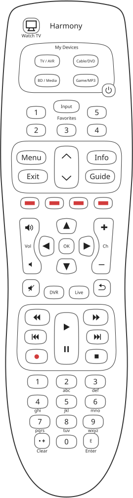

# Harmony 350: keys

The drawing, [`reference/silhouettes/h350.svg`](../../silhouettes/h350.svg), is generated from
`packages/silhouettes/src/models/h350.ts`, traced from the vector button page of Logitech's manual and
counted shape by shape. The Harmony 300's drawing takes every shape from it.

## The keys Logitech's manual names

1. **Watch TV**: "Powers devices on/off for your Watch TV Activity".
2. **Device buttons**: "Set the remote to control specific devices", printed `TV / AVR`, `Cable/DVD`,
   `BD / Media` and `Game/MP3` under "My Devices", each with a short press and a two second press.
3. **Favorite Channel buttons**: "Configure these buttons for quick access to favorite TV channels", five.
4. **Color buttons**: red, green, yellow and blue.
5. **Power button**: "Select one of the Device buttons, then use the Power button to turn that device on
   or off."

Logitech's manual, "Buttons". The rest is an ordinary keypad: menu, guide, info and exit, the direction
pad and OK, volume and channel, mute, DVR, Live, previous channel, the transport keys, digits, clear and
enter, `h350.ts`.

## Every key on the drawing

<!-- generated:keys -->
55 keys on the drawing `h350`, 55 on the keypad and 0 that the screen speaks for. 0 carry a measured scan code and 0 are left between two candidates by the drawing.

| key | kind | name from | scan code | screen zone | printed on or beside it |
|---|---|---|---|---|---|
| `BdMedia` | keypad | printed | not measured |  | BD / Media |
| `Blue` | keypad | printed | not measured |  |  |
| `CableDvd` | keypad | printed | not measured |  | Cable/DVD |
| `ChannelDown` | keypad | printed | not measured |  |  |
| `ChannelUp` | keypad | printed | not measured |  |  |
| `Clear` | keypad | printed | not measured |  | Clear |
| `DirectionDown` | keypad | printed | not measured |  |  |
| `DirectionLeft` | keypad | printed | not measured |  |  |
| `DirectionRight` | keypad | printed | not measured |  |  |
| `DirectionUp` | keypad | printed | not measured |  |  |
| `DownArrow` | keypad | printed | not measured |  |  |
| `Dvr` | keypad | printed | not measured |  | DVR |
| `Enter` | keypad | printed | not measured |  | E, Enter |
| `Exit` | keypad | printed | not measured |  | Exit |
| `FastForward` | keypad | printed | not measured |  |  |
| `Favorite1` | keypad | printed | not measured |  | 1 |
| `Favorite2` | keypad | printed | not measured |  | 2 |
| `Favorite3` | keypad | printed | not measured |  | 3 |
| `Favorite4` | keypad | printed | not measured |  | 4 |
| `Favorite5` | keypad | printed | not measured |  | 5 |
| `GameMp3` | keypad | printed | not measured |  | Game/MP3 |
| `Green` | keypad | printed | not measured |  |  |
| `Guide` | keypad | printed | not measured |  | Guide |
| `Info` | keypad | printed | not measured |  | Info |
| `Input` | keypad | printed | not measured |  | Input |
| `Live` | keypad | printed | not measured |  | Live |
| `Menu` | keypad | printed | not measured |  | Menu |
| `Number0` | keypad | printed | not measured |  | 0 |
| `Number1` | keypad | printed | not measured |  | 1 |
| `Number2` | keypad | printed | not measured |  | 2, abc |
| `Number3` | keypad | printed | not measured |  | 3, def |
| `Number4` | keypad | printed | not measured |  | 4, ghi |
| `Number5` | keypad | printed | not measured |  | 5, jkl |
| `Number6` | keypad | printed | not measured |  | 6, mno |
| `Number7` | keypad | printed | not measured |  | 7, pqrs |
| `Number8` | keypad | printed | not measured |  | 8, tuv |
| `Number9` | keypad | printed | not measured |  | 9, wxyz |
| `Pause` | keypad | printed | not measured |  |  |
| `Play` | keypad | printed | not measured |  |  |
| `Power` | keypad | printed | not measured |  |  |
| `PrevChannel` | keypad | printed | not measured |  |  |
| `Record` | keypad | printed | not measured |  |  |
| `Red` | keypad | printed | not measured |  |  |
| `Rewind` | keypad | printed | not measured |  |  |
| `Select` | keypad | printed | not measured |  | OK |
| `SkipBack` | keypad | printed | not measured |  |  |
| `SkipForward` | keypad | printed | not measured |  |  |
| `Stop` | keypad | printed | not measured |  |  |
| `TvAvr` | keypad | printed | not measured |  | TV / AVR |
| `UpArrow` | keypad | printed | not measured |  |  |
| `VolumeDown` | keypad | printed | not measured |  |  |
| `VolumeMute` | keypad | printed | not measured |  |  |
| `VolumeUp` | keypad | printed | not measured |  |  |
| `WatchTV` | keypad | printed | not measured |  | Watch TV |
| `Yellow` | keypad | printed | not measured |  |  |

Generated from `packages/silhouettes/src/models/h350.ts` by `make remote-reference-write`. Change the source, not this block.
<!-- /generated -->

## No scan codes

**Nothing measured ties a key on this architecture to a scan code**, `h350.ts`, and the drawing's test
asserts that none is claimed, `packages/silhouettes/test/models.test.ts`. The configuration's key table
after the `LWJL` marker holds an instruction against each scan code, section 259, and mode 0's list holds
9, 11 or 13 entries over the five configurations read, sections 311 and 315; which physical key each code
is needs this generation's keypad scanner read, which nobody has done.

## Not checked

* Every key's scan code.
* How the firmware tells a two second device key press from a short one.
