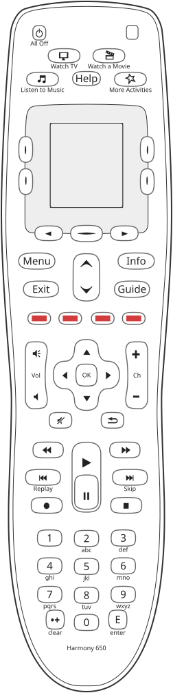

# Harmony 650: keys

**The Harmony 650 has the Harmony 600's face**, key for key: the 600, 650 and 700 share one layout
and one form factor, and the only difference on the face is the model number at the bottom, Danny's
statement holding all three. So its drawing,
[`reference/silhouettes/h650.svg`](../../silhouettes/h650.svg), is generated from
`packages/silhouettes/src/models/h650.ts`, which takes every shape and scan code from the 600's model by
reference and changes only the nameplate. The 650's manual draws the same keys with the same printed
words, page 2, which agrees with the statement and is not a measurement of the case. Whether the
650's case differs in colour or finish is **not checked** and does not matter to the drawing.

## The two populations

A key is either on the **keypad**, bound by the activity and device maps, or one **the screen speaks
for**, whose meaning is whatever the current page draws beside it. On this architecture the two share
no scan code at all, section 128. The screen keys are the four flanking the display and the three
below it:

| screen key | scan | what it does | standing and source |
|---|---|---|---|
| upper left of the display | 8 | the item drawn beside it | read from configurations, every corner page of four arch 14 configurations including the 650's, section 285 |
| upper right | 2 | the same | the same |
| lower left | 9 | the same | the same |
| lower right | 34 | the same | the same |
| centre key below the display | 25 | "Devices" on an activity's screens, "Activity" or "Activities" on a device list, "Exit" in mode 0 | read from configurations, sections 290, 294 and 311; the words seen at the bench on the 650, sections 285 and 294 |
| left and right arrows below the display | **not measured** | turn the page of a list | Logitech's manual, "the arrow buttons below the screen"; the scan codes are **not checked** |

The 650's manual: "The arrow buttons help you move through each page of options, while the side buttons
allow you to choose an option. The center button lets you switch between Activities and devices, or
return to the devices list."

## Every key on the drawing

The drawing's own list, generated. A scan code appears only where `reference/button-maps.md` names it,
which was measured on the **Harmony 600's** calibration configuration, section 133. On the 650 the same
codes are carried over on the strength of the shared face; the 650's own button map has **not** been
measured. What does hold on the 650 is that its mode 0 lists every scan from 1 to 54, section 311, so it
has the same 54 codes.

<!-- generated:keys -->
54 keys on the drawing `h650`, 42 on the keypad and 12 that the screen speaks for. 36 carry a measured scan code and 4 are left between two candidates by the drawing.

| key | kind | name from | scan code | screen zone | printed on or beside it |
|---|---|---|---|---|---|
| `Menu` | keypad | catalogue | 10 (0x0A) |  | Menu |
| `Exit` | keypad | catalogue | 12 (0x0C) |  | Exit |
| `Red` | keypad | catalogue | 13 (0x0D) |  |  |
| `VolumeUp` | keypad | catalogue | 14 (0x0E) |  |  |
| `VolumeDown` | keypad | catalogue | 15 (0x0F) |  |  |
| `VolumeMute` | keypad | catalogue | 16 (0x10) |  |  |
| `Number4` | keypad | catalogue | 17 (0x11) |  | 4, ghi |
| `Number7` | keypad | catalogue | 18 (0x12) |  | 7, pqrs |
| `NumberPlus` | keypad | catalogue | 19 (0x13) |  | clear |
| `Number0` | keypad | catalogue | 20 (0x14) |  | 0 |
| `SkipBack` | keypad | catalogue | 21 (0x15) |  | Replay |
| `Rewind` | keypad | catalogue | 22 (0x16) |  |  |
| `Record` | keypad | catalogue | 23 (0x17) |  |  |
| `Number1` | keypad | catalogue | 24 (0x18) |  | 1 |
| `Yellow` | keypad | catalogue | 28 (0x1C) |  |  |
| `Blue` | keypad | catalogue | 29 (0x1D) |  |  |
| `FastForward` | keypad | catalogue | 30 (0x1E) |  |  |
| `ChannelUp` | keypad | catalogue | 31 (0x1F) |  |  |
| `ChannelDown` | keypad | catalogue | 32 (0x20) |  |  |
| `Guide` | keypad | catalogue | 33 (0x21) |  | Guide |
| `Info` | keypad | catalogue | 36 (0x24) |  | Info |
| `Number6` | keypad | catalogue | 37 (0x25) |  | 6, mno |
| `SkipForward` | keypad | catalogue | 38 (0x26) |  | Skip |
| `Number3` | keypad | catalogue | 39 (0x27) |  | 3, def |
| `Stop` | keypad | catalogue | 40 (0x28) |  |  |
| `DirectionRight` | keypad | catalogue | 41 (0x29) |  |  |
| `PrevChannel` | keypad | catalogue | 43 (0x2B) |  |  |
| `Play` | keypad | catalogue | 44 (0x2C) |  |  |
| `Number9` | keypad | catalogue | 45 (0x2D) |  | 9, wxyz |
| `Pause` | keypad | catalogue | 46 (0x2E) |  |  |
| `Number2` | keypad | catalogue | 47 (0x2F) |  | 2, abc |
| `Number5` | keypad | catalogue | 48 (0x30) |  | 5, jkl |
| `Green` | keypad | catalogue | 49 (0x31) |  |  |
| `Select` | keypad | catalogue | 51 (0x33) |  | OK |
| `DirectionLeft` | keypad | catalogue | 52 (0x34) |  |  |
| `Number8` | keypad | catalogue | 53 (0x35) |  | 8, tuv |
| `AllOff` | keypad | printed | not measured |  | All Off |
| `DirectionDown` | keypad | catalogue | one of 27 or 42 |  |  |
| `DirectionUp` | keypad | catalogue | one of 26 or 50 |  |  |
| `DownArrow` | keypad | catalogue | one of 27 or 42 |  |  |
| `Enter` | keypad | printed | not measured |  | E, enter |
| `UpArrow` | keypad | catalogue | one of 26 or 50 |  |  |
| `Help` | screen | printed | not measured |  | Help |
| `ListenToMusic` | screen | printed | not measured |  | Listen to Music |
| `MoreActivities` | screen | printed | not measured |  | More Activities |
| `ScreenLowerLeft` | screen | printed | not measured | 3 |  |
| `ScreenLowerRight` | screen | printed | not measured | 4 |  |
| `ScreenNext` | screen | printed | not measured |  |  |
| `ScreenPrev` | screen | printed | not measured |  |  |
| `ScreenSelect` | screen | printed | not measured | 5 |  |
| `ScreenUpperLeft` | screen | printed | not measured | 1 |  |
| `ScreenUpperRight` | screen | printed | not measured | 2 |  |
| `WatchAMovie` | screen | printed | not measured |  | Watch a Movie |
| `WatchTV` | screen | printed | not measured |  | Watch TV |

Generated from `packages/silhouettes/src/models/h650.ts` by `make remote-reference-write`. Change the source, not this block.
<!-- /generated -->

## What the drawing does not yet carry

These are measured elsewhere and the drawing has not caught up. The drawing is the source of the table
above, so the fix belongs there and not in this file.

| key | the measurement | standing and source |
|---|---|---|
| the four up and down keys | **decided** since section 323: 26 is `UpArrow`, 27 `DownArrow`, 50 `DirectionUp`, 42 `DirectionDown` | from the device maps of the Harmony 600's calibration configuration, `reference/button-maps.md`. The drawing still leaves each between two candidates |
| the four screen corners and the centre key | 8, 2, 9, 34 and 25, above | read from configurations, sections 285 and 311 |
| Watch TV, Watch a Movie, Listen to Music | 5, 1 and 7 | read from 13 Logitech compiles including two of the 650's, section 314. Listen to Music by elimination |
| More Activities | 4 | **not measured**, section 314 says so |

The drawing calls the activity keys and Help `screen` keys, which is a statement about the drawing's
layers. In the configuration they are hard keys bound by the always installed key map, section 314, not
keys the screen speaks for.

## Keys with no code at all

* **Help** and **All Off** carry no measured scan code here. `AllOff` sends the activity's off sequence
  per the manual. Section 306 records that "the keypad's power button" does nothing in the Panasonic
  television's device mode on the 650, because that device's power commands are bound to screen keys
  only; **All Off is the only key on the drawing that can be meant**, which is this reference's reading
  and is not checked.
* **No Devices key.** Device mode is the centre key below the display, under the word "Devices"; see
  [behaviour.md](behaviour.md).

## Not checked

* The 650's own button map: every scan code above is the 600's, carried over.
* The scan codes of the two arrows below the display, Help, All Off, Enter and More Activities.
* Long press on any key: Logitech's service declares none for this model, `reference/capabilities.md`.
