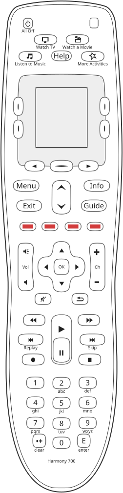

# Harmony 700: keys

**The Harmony 700 has the Harmony 600's face**, key for key: the 600, 650 and 700 share one layout and
one form factor, and the only difference on the face is the model number at the bottom, a statement from
the bench holding all three. So its drawing, [`reference/silhouettes/h700.svg`](../../silhouettes/h700.svg),
is generated from `packages/silhouettes/src/models/h700.ts`, which takes every shape and scan code from
the 600's model by reference and changes only the nameplate. The 700's manual draws the same keys, "The
buttons on your Harmony 700", Logitech's manual page 5.

## Where the scan codes come from

Every scan code on the drawing was **measured on the Harmony 600**, section 133 and
`reference/button-maps.md`, and is carried over on the strength of the shared face; the 700's own button
map has **not** been measured. What holds on the 700 itself: its mode 0 lists the 600's 162 key events in
the 600's order, section 311, so it has the same 54 scans; and the keypad scanner, a 14 by 4 matrix
returning `row * 4 + column`, was first read in the 700's 2.8 image, section 13.

The screen keys, 8, 2, 9 and 34 for the corners and 25 for the centre key, are read from configurations
including the 700's, sections 285 and 311; the Harmony 650's [keys.md](../harmony-650/keys.md) has the
table. The activity keys, scans 5, 1 and 7, are one entry each in a key map that is always installed, read
from Logitech's compiles including four of the 700's, section 314.

## Every key on the drawing

<!-- generated:keys -->
54 keys on the drawing `h700`, 42 on the keypad and 12 that the screen speaks for. 36 carry a measured scan code and 4 are left between two candidates by the drawing.

| key | kind | name from | scan code | screen zone | printed on or beside it |
|---|---|---|---|---|---|
| `Menu` | keypad | catalogue | 10 (0x0A) |  | Menu |
| `Exit` | keypad | catalogue | 12 (0x0C) |  | Exit |
| `Red` | keypad | catalogue | 13 (0x0D) |  |  |
| `VolumeUp` | keypad | catalogue | 14 (0x0E) |  |  |
| `VolumeDown` | keypad | catalogue | 15 (0x0F) |  |  |
| `VolumeMute` | keypad | catalogue | 16 (0x10) |  |  |
| `Number4` | keypad | catalogue | 17 (0x11) |  | 4, ghi |
| `Number7` | keypad | catalogue | 18 (0x12) |  | 7, pqrs |
| `NumberPlus` | keypad | catalogue | 19 (0x13) |  | clear |
| `Number0` | keypad | catalogue | 20 (0x14) |  | 0 |
| `SkipBack` | keypad | catalogue | 21 (0x15) |  | Replay |
| `Rewind` | keypad | catalogue | 22 (0x16) |  |  |
| `Record` | keypad | catalogue | 23 (0x17) |  |  |
| `Number1` | keypad | catalogue | 24 (0x18) |  | 1 |
| `Yellow` | keypad | catalogue | 28 (0x1C) |  |  |
| `Blue` | keypad | catalogue | 29 (0x1D) |  |  |
| `FastForward` | keypad | catalogue | 30 (0x1E) |  |  |
| `ChannelUp` | keypad | catalogue | 31 (0x1F) |  |  |
| `ChannelDown` | keypad | catalogue | 32 (0x20) |  |  |
| `Guide` | keypad | catalogue | 33 (0x21) |  | Guide |
| `Info` | keypad | catalogue | 36 (0x24) |  | Info |
| `Number6` | keypad | catalogue | 37 (0x25) |  | 6, mno |
| `SkipForward` | keypad | catalogue | 38 (0x26) |  | Skip |
| `Number3` | keypad | catalogue | 39 (0x27) |  | 3, def |
| `Stop` | keypad | catalogue | 40 (0x28) |  |  |
| `DirectionRight` | keypad | catalogue | 41 (0x29) |  |  |
| `PrevChannel` | keypad | catalogue | 43 (0x2B) |  |  |
| `Play` | keypad | catalogue | 44 (0x2C) |  |  |
| `Number9` | keypad | catalogue | 45 (0x2D) |  | 9, wxyz |
| `Pause` | keypad | catalogue | 46 (0x2E) |  |  |
| `Number2` | keypad | catalogue | 47 (0x2F) |  | 2, abc |
| `Number5` | keypad | catalogue | 48 (0x30) |  | 5, jkl |
| `Green` | keypad | catalogue | 49 (0x31) |  |  |
| `Select` | keypad | catalogue | 51 (0x33) |  | OK |
| `DirectionLeft` | keypad | catalogue | 52 (0x34) |  |  |
| `Number8` | keypad | catalogue | 53 (0x35) |  | 8, tuv |
| `AllOff` | keypad | printed | not measured |  | All Off |
| `DirectionDown` | keypad | catalogue | one of 27 or 42 |  |  |
| `DirectionUp` | keypad | catalogue | one of 26 or 50 |  |  |
| `DownArrow` | keypad | catalogue | one of 27 or 42 |  |  |
| `Enter` | keypad | printed | not measured |  | E, enter |
| `UpArrow` | keypad | catalogue | one of 26 or 50 |  |  |
| `Help` | screen | printed | not measured |  | Help |
| `ListenToMusic` | screen | printed | not measured |  | Listen to Music |
| `MoreActivities` | screen | printed | not measured |  | More Activities |
| `ScreenLowerLeft` | screen | printed | not measured | 3 |  |
| `ScreenLowerRight` | screen | printed | not measured | 4 |  |
| `ScreenNext` | screen | printed | not measured |  |  |
| `ScreenPrev` | screen | printed | not measured |  |  |
| `ScreenSelect` | screen | printed | not measured | 5 |  |
| `ScreenUpperLeft` | screen | printed | not measured | 1 |  |
| `ScreenUpperRight` | screen | printed | not measured | 2 |  |
| `WatchAMovie` | screen | printed | not measured |  | Watch a Movie |
| `WatchTV` | screen | printed | not measured |  | Watch TV |

Generated from `packages/silhouettes/src/models/h700.ts` by `make remote-reference-write`. Change the source, not this block.
<!-- /generated -->

## What the drawing does not yet carry

The same as the 600's, [keys.md](../harmony-600/keys.md): the four up and down keys are decided since
section 323 and the drawing still leaves them between two candidates, and More Activities' scan 4 is not
measured. One difference: on the 700 the activity key with no activity enters **mode 4**, the "add an
Activity" placeholder, where the 600 and 650 enter mode 0, section 314.

## Not checked

* The 700's own button map: every scan code above is the 600's.
* The scan codes of the two arrows below the display, Help, All Off, Enter and More Activities.
* The key handler on the 2.8 build beyond the scanner, section 13.
