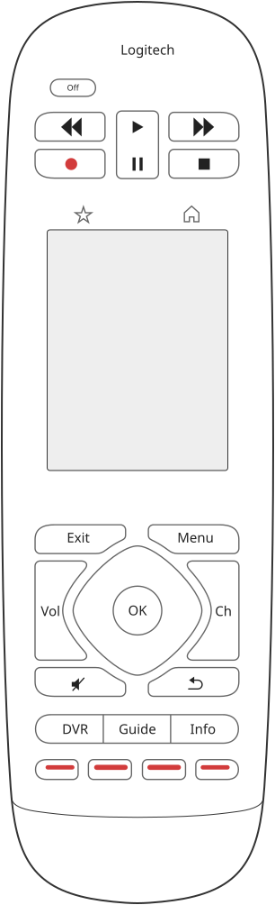

# Harmony Touch: keys

The drawing, [`reference/silhouettes/touch.svg`](../../silhouettes/touch.svg), is generated from
`packages/silhouettes/src/models/touch.ts`. Its geometry is Logitech's own vector drawing from the setup
guide's "Know your product" page, moved into this package's coordinates; its symbols and words are read
off a photograph of the whole face, and drawing and photograph agree mark for mark, `touch.ts`.

## Every key on the drawing

<!-- generated:keys -->
29 keys on the drawing `touch`, 27 on the keypad, 2 on the touch panel and 0 that the screen speaks for. 0 carry a measured scan code and 0 are left between two candidates by the drawing.

| key | kind | name from | scan code | screen zone | printed on or beside it |
|---|---|---|---|---|---|
| `Blue` | keypad | printed | not measured |  |  |
| `ChannelDown` | keypad | printed | not measured |  |  |
| `ChannelUp` | keypad | printed | not measured |  |  |
| `DirectionDown` | keypad | printed | not measured |  |  |
| `DirectionLeft` | keypad | printed | not measured |  |  |
| `DirectionRight` | keypad | printed | not measured |  |  |
| `DirectionUp` | keypad | printed | not measured |  |  |
| `Dvr` | keypad | printed | not measured |  | DVR |
| `Exit` | keypad | printed | not measured |  | Exit |
| `FastForward` | keypad | printed | not measured |  |  |
| `Green` | keypad | printed | not measured |  |  |
| `Guide` | keypad | printed | not measured |  | Guide |
| `Info` | keypad | printed | not measured |  | Info |
| `Menu` | keypad | printed | not measured |  | Menu |
| `Off` | keypad | printed | not measured |  | Off |
| `Pause` | keypad | printed | not measured |  |  |
| `Play` | keypad | printed | not measured |  |  |
| `PrevChannel` | keypad | printed | not measured |  |  |
| `Record` | keypad | printed | not measured |  |  |
| `Red` | keypad | printed | not measured |  |  |
| `Rewind` | keypad | printed | not measured |  |  |
| `Select` | keypad | printed | not measured |  | OK |
| `Stop` | keypad | printed | not measured |  |  |
| `VolumeDown` | keypad | printed | not measured |  |  |
| `VolumeMute` | keypad | printed | not measured |  |  |
| `VolumeUp` | keypad | printed | not measured |  |  |
| `Yellow` | keypad | printed | not measured |  |  |
| `Favorites` | touch | printed | not measured |  |  |
| `Home` | touch | printed | not measured |  |  |

Generated from `packages/silhouettes/src/models/touch.ts` by `make remote-reference-write`. Change the source, not this block.
<!-- /generated -->

## No scan codes, and none can be had here

**No key on this model carries a scan code**, and that is not an omission: this library has never read a
key off a Touch, its configuration is not reachable as a file, Logitech's service will not compile one,
and `reference/button-maps.md` has no table for it, `touch.ts` and sections 200 and 202. The drawing's
test refuses a scan code with no reference table behind it, `packages/silhouettes/test/models.test.ts`.

## The two marks above the screen

**Home and Favorites are keys whose shape is the printed mark**: the manual's legend lists both among the
buttons, the guide says to tap them, and the product prints a house and a star on the bezel with no key
edge around either, `touch.ts`. They are drawn as touch keys for that reason. Home shows the activities,
Favorites the favourite channels, Logitech's manual, "Know your product".

## What the keys do, by Logitech's legend

| key | what it does | standing and source |
|---|---|---|
| Off | "turns off all of the devices for an activity" rather than one device | Logitech's manual, "Turning your system off" |
| Home | shows the activities on the screen; in device mode the way to the device list | Logitech's manual, "Using your Activities" and "Using Devices" |
| Favorites | shows the favourite channels | Logitech's manual |
| the colour keys | cable, satellite or Blu-ray functions | Logitech's manual, "Know your product" |
| DVR, Guide, Info | the set top box's record menu, programme listings and information | Logitech's manual |
| Menu, Exit, OK, the direction pad | the television's menus | Logitech's manual |
| volume and channel rockers, mute, previous | as printed; the rockers print `Vol` and `Ch` and nothing else | Logitech's manual; `touch.ts` |

## Holding a key

**A long press exists on this model**: Logitech's product record declares `LongPressAction` for skin 99,
`SKINS_WITH_A_LONG_PRESS` in `packages/usb/src/models.ts`. A key with one cannot also repeat, because the
firmware has to wait to learn which was meant, `docs/how-a-harmony-works.md`. Which keys have one, and how
long the press is, is **not checked**.

## Not checked

* Every scan code, and whether the two marks above the screen are keys of the keypad or areas of the
  touch panel.
* Which keys take a long press.
